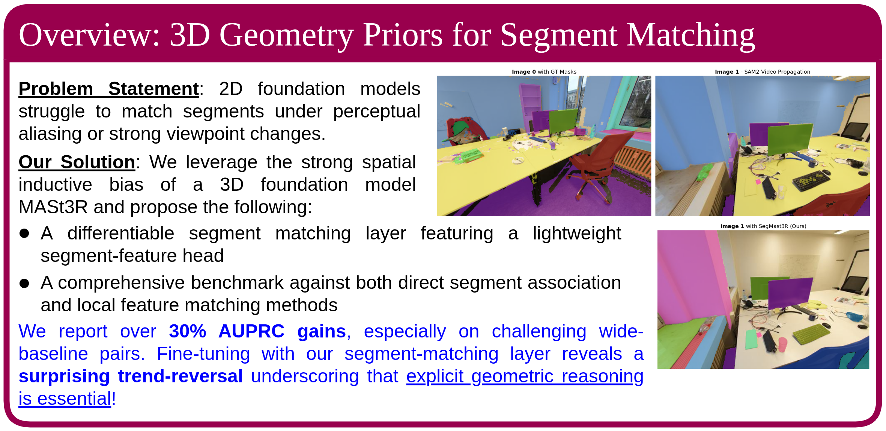

<div align="center">
<h1>SegMASt3R: Geometry Grounded Matching</h1>

⭐ **NeurIPS 2025 Spotlight** ⭐

<a href="https://arxiv.org/abs/2510.05051"></a>
<a href="https://openreview.net/pdf/dfdd2dc2708abda7439bc296d4e865d6f76924e8.pdf"></a>
<a href="https://segmast3r.github.io/"></a>

</div>

<p align="center">
    
    <br>
    <em>SegMASt3R provides geometry-grounded matching for instance-level segmentation and correspondence.</em>
</p>

## Stay Tuned for Upcoming Updates!
- Pose-bin based benchmarking
- Training code release and more pre-trained models
- Downstream tasks: navigation and 3D instance mapping

## Quick Start

Try the interactive demo:

```bash
gradio gradio_app_rr.py
```

## Table of Contents

- [Installation](#installation)
- [Checkpoints](#checkpoints)
- [License](#license)


## Installation

Adapted from [MASt3R](https://github.com/naver/mast3r/blob/main/README.md)

1. Clone this repo.
```bash
git clone https://github.com/SegMASt3R/segmast3r.git
cd segmast3r
```

2. Create the environment.
```bash
conda create -n segmast3r python=3.11 cmake=3.14.0
conda activate segmast3r 
conda install pytorch torchvision pytorch-cuda=12.1 -c pytorch -c nvidia  # use the correct version of cuda for your system
pip install -r mast3r_src/dust3r/requirements.txt
# Optional: you can also install additional packages to:
# - add support for HEIC images
# - add required packages for visloc.py
pip install -r mast3r_src/dust3r/requirements_optional.txt

# Install Segmentor (Ultralytics FastSAM OR SAM2)
pip install -U ultralytics
# OR
cd ..
git clone https://github.com/facebookresearch/sam2.git && cd sam2
pip install -e .

# Install visualization packages
pip install gradio rerun-sdk
```

3. Optional, compile the cuda kernels for RoPE (as in CroCo v2). Make sure to edit `all_cuda_archs` in `mast3r_src/dust3r/croco/models/curope/setup.py` to match your GPU compute capability.

```bash
# DUST3R relies on RoPE positional embeddings for which you can compile some cuda kernels for faster runtime.
# 
cd mast3r_src/dust3r/croco/models/curope/
python setup.py build_ext --inplace
cd ../../../../../
```

## Checkpoints

Download the pre-trained model checkpoint from Hugging Face:

```bash
mkdir -p checkpoints
wget https://huggingface.co/rjayanti/segmast3r/resolve/main/segmast3r_spp.ckpt -O checkpoints/segmast3r_spp.ckpt
```

## License

This code is licensed under **CC BY-NC 4.0 (Non-Commercial)**. The pre-trained model checkpoints inherit the licenses of the underlying training datasets and pre-trained models (MASt3R, DUSt3R) and as a result, may not be used for commercial purposes. Please refer to the respective dataset and model licenses for more details.

## Citation

If you find our repository useful, please consider giving it a star ⭐ and citing our paper in your work:

```bibtex
@article{Jayanti2025SegMASt3R,
  author    = {Rohit Jayanti and
               Swayam Agrawal and
               Vansh Garg and
               Siddharth Tourani and
               Muhammad Haris Khan and
               Sourav Garg and
               Madhava Krishna},
  title     = {SegMASt3R: Geometry Grounded Segment Matching},
  booktitle = {Advances in Neural Information Processing Systems},
  year      = {2025},
  volume    = {38},
  url       = {https://neurips.cc/virtual/2025/loc/san-diego/poster/119228},
}
``` 